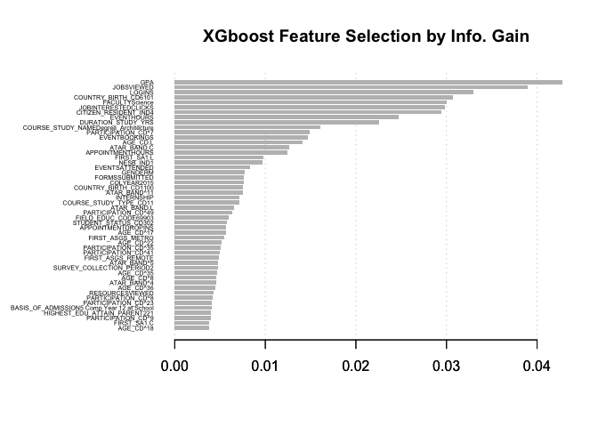
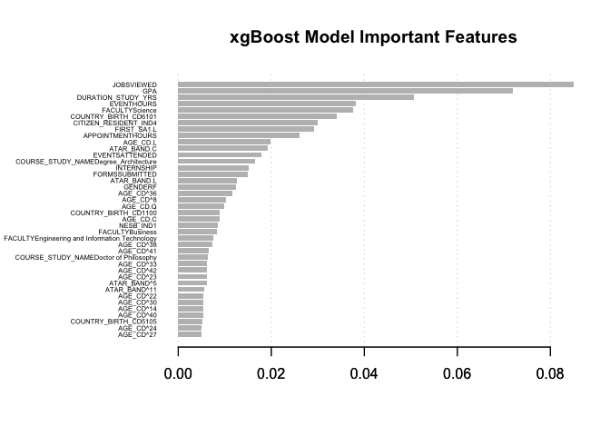
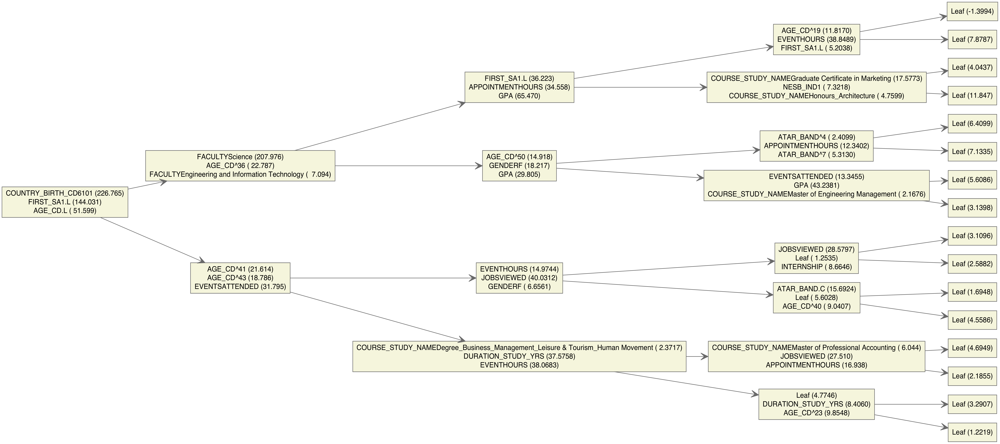

Prediction Modelling for Graduate Employment Status
================

``` r
#---------------------------------------------------------------------------------------
#  R  Program : GOS_predict_v1.R
#  Author     : Raul Manongdo, University of Technology Sydney
#               UTS Connected Intelligence Centre
#  Date       : May 2018
#  Program description:
#     Mulit-nomial prediction modelling into 4 possible employment status using xgBoost
#     Feature selection using xgBoost and Pearson correlation
#     Train/Test at 75/25%  population split
#     Generates descriptive bar chart, variable correlation chart,  ranked feature
#          importance, model performance and decision trees/rules
#---------------------------------------------------------------------------------------

library(data.table,quietly=TRUE)
library(Matrix,quietly=TRUE)
```

    ## Warning: package 'Matrix' was built under R version 3.4.4

``` r
library(xgboost,quietly=TRUE)
library(caret,quietly=TRUE)
```

    ## Warning: package 'caret' was built under R version 3.4.4

``` r
library(corrplot,quietly = TRUE)
```

    ## corrplot 0.84 loaded

``` r
library(DiagrammeR,quietly = TRUE)
library(bindrcpp,quietly = TRUE)
```

    ## Warning: package 'bindrcpp' was built under R version 3.4.4

``` r
library(ggthemes) 
library(extrafont)
```

    ## Registering fonts with R

``` r
library(stringi)
library(knitr)


#Function below copied from Gitb 
#https://github.com/dmlc/xgboost/blob/master/R-package/R/xgb.plot.multi.trees.R
xgb.plot.multi.trees <- function(model, feature_names = NULL, features_keep = 5, plot_width = NULL, plot_height = NULL,
                                 render = TRUE, ...){
  #  check.deprecation(...)
  tree.matrix <- xgb.model.dt.tree(feature_names = feature_names, model = model)
  
  # first number of the path represents the tree, then the following numbers are related to the path to follow
  # root init
  root.nodes <- tree.matrix[stri_detect_regex(ID, "\\d+-0"), ID]
  tree.matrix[ID %in% root.nodes, abs.node.position := root.nodes]
  
  precedent.nodes <- root.nodes
  
  while(tree.matrix[,sum(is.na(abs.node.position))] > 0) {
    yes.row.nodes <- tree.matrix[abs.node.position %in% precedent.nodes & !is.na(Yes)]
    no.row.nodes <- tree.matrix[abs.node.position %in% precedent.nodes & !is.na(No)]
    yes.nodes.abs.pos <- yes.row.nodes[, abs.node.position] %>% paste0("_0")
    no.nodes.abs.pos <- no.row.nodes[, abs.node.position] %>% paste0("_1")
    
    tree.matrix[ID %in% yes.row.nodes[, Yes], abs.node.position := yes.nodes.abs.pos]
    tree.matrix[ID %in% no.row.nodes[, No], abs.node.position := no.nodes.abs.pos]
    precedent.nodes <- c(yes.nodes.abs.pos, no.nodes.abs.pos)
  }
  
  tree.matrix[!is.na(Yes), Yes := paste0(abs.node.position, "_0")]
  tree.matrix[!is.na(No), No := paste0(abs.node.position, "_1")]
  
  remove.tree <- . %>% stri_replace_first_regex(pattern = "^\\d+-", replacement = "")
  
  tree.matrix[,`:=`(abs.node.position = remove.tree(abs.node.position),
                    Yes = remove.tree(Yes),
                    No = remove.tree(No))]
  
  nodes.dt <- tree.matrix[
    , .(Quality = sum(Quality))
    , by = .(abs.node.position, Feature)
    ][, .(Text = paste0(Feature[1:min(length(Feature), features_keep)],
                        " (",
                        format(Quality[1:min(length(Quality), features_keep)], digits=5),
                        ")") %>%
            paste0(collapse = "\n"))
      , by = abs.node.position]
  
  edges.dt <- tree.matrix[Feature != "Leaf", .(abs.node.position, Yes)] %>%
    list(tree.matrix[Feature != "Leaf",.(abs.node.position, No)]) %>%
    rbindlist() %>%
    setnames(c("From", "To")) %>%
    .[, .N, .(From, To)] %>%
    .[, N:=NULL]
  
  nodes <- DiagrammeR::create_node_df(
    n = nrow(nodes.dt),
    label = nodes.dt[,Text]
  )
  
  edges <- DiagrammeR::create_edge_df(
    from = match(edges.dt[,From], nodes.dt[,abs.node.position]),
    to = match(edges.dt[,To], nodes.dt[,abs.node.position]),
    rel = "leading_to")
  
  graph <- DiagrammeR::create_graph(
    nodes_df = nodes,
    edges_df = edges,
    attr_theme = NULL
  ) %>%
    DiagrammeR::add_global_graph_attrs(
      attr_type = "graph",
      attr  = c("layout", "rankdir"),
      value = c("dot", "LR")
    ) %>%
    DiagrammeR::add_global_graph_attrs(
      attr_type = "node",
      attr  = c("color", "fillcolor", "style", "shape", "fontname"),
      value = c("DimGray", "beige", "filled", "rectangle", "Helvetica")
    ) %>%
    DiagrammeR::add_global_graph_attrs(
      attr_type = "edge",
      attr  = c("color", "arrowsize", "arrowhead", "fontname"),
      value = c("DimGray", "1.5", "vee", "Helvetica"))
  
  if (!render) return(invisible(graph))
  
  DiagrammeR::render_graph(graph, width = plot_width, height = plot_height)
}

globalVariables(c(".N", "N", "From", "To", "Text", "Feature", "no.nodes.abs.pos",
                  "ID", "Yes", "No", "Tree", "yes.nodes.abs.pos", "abs.node.position",
                  "GOS_Path" <- '/Users/raulmanongdo/Documents/GOS-2017'))
```

    ##  [1] ".N"                                    
    ##  [2] "N"                                     
    ##  [3] "From"                                  
    ##  [4] "To"                                    
    ##  [5] "Text"                                  
    ##  [6] "Feature"                               
    ##  [7] "no.nodes.abs.pos"                      
    ##  [8] "ID"                                    
    ##  [9] "Yes"                                   
    ## [10] "No"                                    
    ## [11] "Tree"                                  
    ## [12] "yes.nodes.abs.pos"                     
    ## [13] "abs.node.position"                     
    ## [14] "/Users/raulmanongdo/Documents/GOS-2017"

``` r
# LOAD RAW DATA
setwd(GOS_Path)
raw.data  <-
  utils::read.csv(
    "GOS_2016_2017_dataset.csv",
    header = TRUE,
    na.strings = c("", "NA", "NaN", NULL),
    stringsAsFactors = FALSE
  )

data.dict <-   utils::read.csv(
  "GOS_data_dict_v2.csv",
  header = TRUE,
  stringsAsFactors = FALSE)
data.dict[,'R.Variable.Name'] <- toupper(data.dict[,'R.Variable.Name'])

#Change atribute names for readability
setnames(raw.data,data.dict[,'GOS.Variable.Name'], data.dict[,"R.Variable.Name"])
names(raw.data) <- toupper(names(raw.data))

#Include only selected attributes defined in data.dict
raw.data <- raw.data[,names(raw.data) %in% data.dict[,"R.Variable.Name"][data.dict$Include=='Y']]

y <- sapply(raw.data, function(x) is.integer(x))
vars_Integer <- names(y[y==TRUE])
#print(vars_Integer)

#Special NA processing. 
#Intend to add extra column in data.dict for NA values of each attribute

d<-raw.data
d$USLHRS   <- ifelse(d$USLHRS  %in% c(995,999) | is.na(d$USLHRS) ,0.0,d$USLHRS)
d$ACTLHRS  <- ifelse(d$ACTLHRS %in% c(995,999) | is.na(d$ACTLHRS),0.0,d$ACTLHRS)
d$LOOKPTWK <- ifelse(d$LOOKPTWK %in% c(95,99),5,d$LOOKPTWK)
d$LOOKFTWK <- ifelse(d$LOOKFTWK %in% c(95,99),5,d$LOOKFTWK)
d$ABO_TORRES_ISLAND_CD <- ifelse(d$ABO_TORRES_ISLAND_CD ==9 ,NA,d$ABO_TORRES_ISLAND_CD)
d$FIRST_HE_IN_FAMILY <- ifelse(d$FIRST_HE_IN_FAMILY ==9,NA,d$FIRST_HE_IN_FAMILY)
d$LABOUR_IN_STUDY_AREA_IND <- ifelse(d$LABOUR_IN_STUDY_AREA_IND==0,NA, d$LABOUR_IN_STUDY_AREA_IND)
d$SPCL_COURSE_TYPE_CD <- ifelse (d$SPCL_COURSE_TYPE_CD==0,NA,d$SPCL_COURSE_TYPE_CD)
d$MODE_ATTENDANCE_CD <- ifelse (d$MODE_ATTENDANCE_CD==9,NA,d$MODE_ATTENDANCE_CD)
d$TYPE_ATTENDANCE_CD <- ifelse (d$TYPE_ATTENDANCE_CD==0,NA, d$TYPE_ATTENDANCE_CD)
d$YR_ARRIVAL_AUST <-  ifelse (d$YR_ARRIVAL_AUST %in% c('A998', 'A999','1'),NA, d$YR_ARRIVAL_AUST)
d$HIGHEST_EDU_ATTAIN_PARENT1 <- ifelse (d$HIGHEST_EDU_ATTAIN_PARENT1 %in% c(49,98,99),NA, d$HIGHEST_EDU_ATTAIN_PARENT1)
d$HIGHEST_EDU_ATTAIN_PARENT2 <- ifelse (d$HIGHEST_EDU_ATTAIN_PARENT2 %in% c(49,98,99),NA, d$HIGHEST_EDU_ATTAIN_PARENT2)

# Reset back to integer as returning NA from above changes data type
for (var in vars_Integer) d[[var]] <- as.integer(d[[var]])

#Label the classs variable
d$Label <- 'NO_LABEL'
d$Label <- ifelse(d$USLHRS>33 | d$ACTLHRS>33,'FTWORK', d$Label)
d$Label <- ifelse (between(d$USLHRS,1,33) | between(d$ACTLHRS,1,33),'PTWORK', d$Label)
d$Label <- ifelse (d$USLHRS==0 | d$ACTLHRS==-0,'NOWORK',d$Label)
d$Label <- ifelse (((d$USLHRS==0 | d$ACTLHRS==-0) &  (d$LOOKPTWK ==5 | d$LOOKFTWK==5)),'NOWORK_NOT_LOOKING',d$Label)
table(d$Label,useNA="always")
```

    ## 
    ##             FTWORK             NOWORK NOWORK_NOT_LOOKING 
    ##               2280                408               1394 
    ##             PTWORK               <NA> 
    ##               1242                  0

``` r
raw.data <- d

# DESCRIPTIVE CHART OF GRADUATE EMPLOYABILITY OUTCOMES
chart <- raw.data[,names(raw.data) %in% c('COLYEAR','SURVEY_COLLECTION_PERIOD','Label')]
chart$Month <- ifelse(chart$SURVEY_COLLECTION_PERIOD==1,'May','Nov')
chart$SURVEY_COLLECTION_PERIOD <- paste(chart$Month,chart$COLYEAR)

tmp <- table(chart$SURVEY_COLLECTION_PERIOD,chart$Label)
chart.prcnt <- tmp/apply(tmp,1,sum)
tmp <- as.data.frame(tmp)
names(tmp) <- c('X','Label','Y')

p4 <- ggplot() + theme_economist() + scale_fill_economist() + 
  theme(plot.title=element_text(family="Tahoma")) +
  geom_bar(aes(y = Y, x = X, fill = Label), data = tmp,stat="identity") +
  theme(legend.position="bottom", legend.direction="horizontal", 
        legend.title = element_blank()) + 
  labs( x="Survey Collection Pedriod",y="Outcomes Count") +
  ggtitle("GOS Survey - Graduates Employment Outcomes")
print(p4)
```


``` r
#Convert applicable attributes into Dates
#Intend to add extra column in data.dict for datw format of each date attribute

raw.data$CREATED <-
  as.Date(as.character(raw.data$CREATED), format = '%m/%d/%Y')
raw.data$COURSE_COMMENCE_DT <-
  as.Date(paste(as.character(raw.data$COURSE_COMMENCE_DT), '01', sep = ''), format = '%Y%m%d') 
raw.data$BEGNLOOK_4_WORK <-
  as.Date(paste(as.character(raw.data$BEGNLOOK_4_WORK), '01', sep = ''), format = '%Y%m%d') 

print ('Drop columns with NA values more than 50%')
```

    ## [1] "Drop columns with NA values more than 50%"

``` r
n50pcnt <- round(nrow(raw.data) * .50)
x <- sapply(raw.data, function(x)
  sum(is.na(x)))
drops <- x[x > n50pcnt]
print (drops)
```

    ## SPCL_COURSE_TYPE_CD     YR_ARRIVAL_AUST     BEGNLOOK_4_WORK 
    ##                5052                3015                4203

``` r
raw.data <- raw.data[, !(names(raw.data) %in% names(drops))]

print('Drop columns with only 1 unique value other than NA')
```

    ## [1] "Drop columns with only 1 unique value other than NA"

``` r
x <- sapply(raw.data, function(x)
  uniqueN(x, na.rm = T))
drops <- x[x == 1]
print (drops)
```

    ## named integer(0)

``` r
raw.data <- raw.data[, !(names(raw.data) %in% names(drops))]

print ('Set to mean NA valued numeric attributes')
```

    ## [1] "Set to mean NA valued numeric attributes"

``` r
y <- sapply(raw.data, function(x) (class(x)=='numeric'))  
vars_Numeric <- names(y[y==TRUE])
print(vars_Numeric)
```

    ## [1] "FIRST_ASGS_METRO"    "FIRST_ASGS_REGIONAL" "FIRST_ASGS_REMOTE"  
    ## [4] "GPA"                 "APPOINTMENTHOURS"    "EVENTHOURS"

``` r
for (var in vars_Numeric) {
  raw.data[[var]] <- ifelse (is.nan(raw.data[[var]]),NA,raw.data[[var]])
  avg <- mean(raw.data[[var]], na.rm = TRUE)
  raw.data[[var]] <- ifelse (is.na(raw.data[[var]]),avg,raw.data[[var]])
}

# For factor variables with levels count over XGboost limit,  
# capped the levels to its max value. Replace the value of factor vars to 'OTHERS'
# Need to verify FactorLevelLimit <- 200 for xgBoost 

FactorLevelLimit <- 200
y <- sapply(raw.data, function(x) ifelse(is.character(x),length(unique(x)),0))
y1 <- (y[y > FactorLevelLimit])
print (y1)
```

    ##          COURSE_NAME COURSE_NAME_4_RECORD    COURSE_STUDY_NAME 
    ##                  293                  248                  208 
    ##      COURSE_STUDY_CD 
    ##                  232

``` r
for (var in names(y1)) {
  b <- raw.data[[var]]
  d <- sort(table(b),decreasing=TRUE,na.last=TRUE)
  inc_Catgry_Value <- names(d[1:FactorLevelLimit])
  raw.data[[var]] <- ifelse(raw.data[[var]] %in% inc_Catgry_Value,raw.data[[var]],
                            ifelse(is.na(raw.data[[var]]),NA,'OTHERS'))
}

print ('For remaining NA categorical values, set value by sampling')
```

    ## [1] "For remaining NA categorical values, set value by sampling"

``` r
x <- sapply(raw.data, function(x) sum(is.na(x)))
x <- x[x > 0]
vars_4_NASampling <- names(x)
print (vars_4_NASampling)
```

    ## [1] "LABOUR_IN_STUDY_AREA_IND"   "ABO_TORRES_ISLAND_CD"      
    ## [3] "STUDENT_STATUS_CD"          "HIGHEST_EDU_ATTAIN_PARENT1"
    ## [5] "HIGHEST_EDU_ATTAIN_PARENT2" "FIRST_HE_IN_FAMILY"        
    ## [7] "FIRST_SA1"                  "ORGUNIT_LEVEL1_NAME"       
    ## [9] "BASIS_OF_ADMISSION"

``` r
for (var in vars_4_NASampling) {
  x <- raw.data[[var]][!is.na(raw.data[[var]])]
  NAsize <- sum(is.na(raw.data[[var]]))
  set.seed(123)
  raw.data[[var]][is.na(raw.data[[var]])] <- sample(x,NAsize,replace=TRUE)
}

print ('Compute Derived Attributes from Dates')
```

    ## [1] "Compute Derived Attributes from Dates"

``` r
SurveyDate <-
  raw.data$CREATED - (30 * 4) #Graduation date is 4 months prior the survey collection date
raw.data$DURATION_STUDY_YRS <-
  as.numeric(round((SurveyDate - raw.data$COURSE_COMMENCE_DT) / 365, 1))

print ('Convert to factors attributes defined in data.dict')
```

    ## [1] "Convert to factors attributes defined in data.dict"

``` r
factorVars <- data.dict[,"R.Variable.Name"][data.dict$Factor=='Y' & !data.dict$Ordered=='Y']
factorVars <- factorVars[factorVars %in% names(raw.data)]

for (var in factorVars)
  raw.data[[var]] <- as.factor(raw.data[[var]])

#Convert to ordered factors
OfactorVars <- data.dict[,"R.Variable.Name"][data.dict$Ordered=='Y']
OfactorVars <- OfactorVars[OfactorVars %in% names(raw.data)]
for (var in OfactorVars)
  raw.data[[var]] <- factor(raw.data[[var]],ordered=TRUE)

#All other attributes follow the natural ordering of its values except below
clevels <- c('x','l','m','h')
raw.data$FIRST_SA1 <- factor(raw.data$FIRST_SA1,levels=clevels,ordered=TRUE)
cLevel <- c('NOWORK_NOT_LOOKING','NOWORK','PTWORK','FTWORK')
raw.data$Label <- factor(raw.data$Label,ordered=TRUE, level=cLevel)

#Remove dependent variables
raw.data <- raw.data[,!names(raw.data) %in% c('USLHRS','ACTLHRS','LOOKPTWK','LOOKFTWK')]
raw.data <- raw.data[,!names(raw.data) %in% c('COURSE_COMMENCE_DT','YR_ARRIVAL_AUST','CREATED')]

Label <- raw.data$Label
raw.data <- cbind(raw.data[,!names(raw.data)=='Label'],Label)

summary(raw.data)
```

    ##  COLYEAR     SURVEY_COLLECTION_PERIOD LABOUR_IN_STUDY_AREA_IND
    ##  2015:  98   1:2509                   1:4964                  
    ##  2016:2537   2:2815                   2: 360                  
    ##  2017:2689                                                    
    ##                                                               
    ##                                                               
    ##                                                               
    ##                                                               
    ##                             COURSE_NAME  
    ##  Bachelor of Business             : 454  
    ##  Bachelor of Nursing              : 201  
    ##  OTHERS                           : 190  
    ##  Doctor of Philosophy             : 138  
    ##  Master of Business Administration: 131  
    ##  Bachelor of Science              : 121  
    ##  (Other)                          :4089  
    ##                         COURSE_NAME_4_RECORD COURSE_STUDY_TYPE_CD GENDER  
    ##  Bachelor of Business             : 582      10     :2663         F:2889  
    ##  Bachelor of Nursing              : 203      4      :1627         M:2435  
    ##  Master of Engineering Management : 150      11     : 365                 
    ##  Bachelor of Science              : 144      9      : 335                 
    ##  Master of Business Administration: 143      2      : 140                 
    ##  Doctor of Philosophy             : 138      7      : 101                 
    ##  (Other)                          :3964      (Other):  93                 
    ##  ABO_TORRES_ISLAND_CD MODE_ATTENDANCE_CD TYPE_ATTENDANCE_CD
    ##  2:5293               1:5051             1:3316            
    ##  3:  31               2:  74             2:2008            
    ##                       3: 199                               
    ##                                                            
    ##                                                            
    ##                                                            
    ##                                                            
    ##  COUNTRY_BIRTH_CD HOME_LANGUAGE_SPOKEN CITIZEN_RESIDENT_IND
    ##  1100   :2958     1      :2784         1:3831              
    ##  6101   : 713     7199   : 400         2:  19              
    ##  7103   : 217     7104   : 299         3: 135              
    ##  5105   : 117     7101   : 265         4:1314              
    ##  5204   : 105     6302   : 205         8:  25              
    ##  6102   :  89     1201   : 149                             
    ##  (Other):1125     (Other):1222                             
    ##                                                    COURSE_STUDY_NAME
    ##  Degree_Business_Management_Leisure & Tourism_Human Movement: 508   
    ##  Degree_Science_Medical Science_Mathematics                 : 345   
    ##  Degree_Architecture                                        : 299   
    ##  Degree_Nursing_Midwifery                                   : 260   
    ##  Degree_Communication_Media_Social Inquiry                  : 216   
    ##  Honours_Science                                            : 203   
    ##  (Other)                                                    :3493   
    ##  COMBINED_COURSE_STUDY_IND FIELD_EDUC_CODE FIELD_EDUC_SUPPLEMENTARY_CD
    ##  0:4688                    80300  : 736    0      :4695               
    ##  1: 636                    30000  : 451    90300  : 235               
    ##                            29900  : 290    90900  : 160               
    ##                            10900  : 223    80301  :  72               
    ##                            60301  : 215    80300  :  58               
    ##                            90900  : 204    80000  :  52               
    ##                            (Other):3205    (Other):  52               
    ##  STUDENT_STATUS_CD COURSE_STUDY_CD HIGHEST_EDU_ATTAIN_PARENT1
    ##  201    :2271      BDBUS144: 508   1      :4972              
    ##  310    :1359      BDSCI144: 345   21     : 109              
    ##  230    : 736      BDDAB144: 299   22     :  80              
    ##  202    : 423      BDNUR144: 260   20     :  77              
    ##  302    : 366      BDHSS144: 216   23     :  38              
    ##  330    : 103      BHSCI048: 203   25     :  27              
    ##  (Other):  66      (Other) :3493   (Other):  21              
    ##  HIGHEST_EDU_ATTAIN_PARENT2     AGE_CD     INDIGINEOUS_IND NESB_IND
    ##  1      :5005               22     : 751   0:5293          0:3943  
    ##  21     : 112               21     : 674   1:  31          1:1381  
    ##  22     :  85               23     : 602                           
    ##  23     :  44               20     : 489                           
    ##  20     :  31               24     : 454                           
    ##  25     :  23               25     : 337                           
    ##  (Other):  24               (Other):2017                           
    ##  CITIZEN_IND DISABILITY_IND PARTICIPATION_CD  STUDY_AREA45 
    ##  0:4010      0:5156         22     : 757     29     :1227  
    ##  1:1314      1: 168         23     : 650     44     : 458  
    ##                             21     : 589     6      : 420  
    ##                             24     : 553     19     : 386  
    ##                             25     : 408     5      : 352  
    ##                             20     : 357     38     : 305  
    ##                             (Other):2010     (Other):2176  
    ##  BROAD_EDUC_CATGRY     CRSFOE     FIRST_HE_IN_FAMILY STUDY_LEVEL
    ##  8      :1752      80300  : 753   1: 215             1:3005     
    ##  10     : 680      30000  : 399   2: 137             2:2163     
    ##  1      : 656      90900  : 267   3:4972             3: 156     
    ##  9      : 507      29900  : 253                                 
    ##  6      : 492      60301  : 213                                 
    ##  3      : 455      10900  : 204                                 
    ##  (Other): 782      (Other):3235                                 
    ##                                    FACULTY                   CAMPUS    
    ##  Business                              :1378   City campus      :5117  
    ##  Engineering and Information Technology: 945   City Campus      :   1  
    ##  Arts and Social Sciences              : 707   Kuring-gai campus: 206  
    ##  Science                               : 694                           
    ##  Design, Architecture and Building     : 662                           
    ##  Health                                : 483                           
    ##  (Other)                               : 455                           
    ##  FIRST_SA1 FIRST_ASGS_METRO FIRST_ASGS_REGIONAL FIRST_ASGS_REMOTE 
    ##  x:1440    Min.   :0.0000   Min.   :0.0000      Min.   :0.000000  
    ##  l: 402    1st Qu.:0.9459   1st Qu.:0.0000      1st Qu.:0.000000  
    ##  m:1473    Median :1.0000   Median :0.0000      Median :0.000000  
    ##  h:2009    Mean   :0.9459   Mean   :0.0529      Mean   :0.001174  
    ##            3rd Qu.:1.0000   3rd Qu.:0.0529      3rd Qu.:0.001174  
    ##            Max.   :1.0000   Max.   :1.0000      Max.   :1.000000  
    ##                                                                   
    ##                              ORGUNIT_LEVEL1_NAME DOMESTIC_OR_INTERNATIONAL
    ##  Business                              :1352     Domestic     :4005       
    ##  Engineering and Information Technology: 961     International:1319       
    ##  Arts and Social Sciences              : 706                              
    ##  Science                               : 668                              
    ##  Design, Architecture and Building     : 665                              
    ##  Health                                : 487                              
    ##  (Other)                               : 485                              
    ##     ATAR_BAND                    BASIS_OF_ADMISSION      GPA       
    ##  Unknown :2257   1 Comp Higher Ed Course  :2374     Min.   :0.000  
    ##  91 - 95 : 572   5 Comp Year 12 at School :1325     1st Qu.:2.319  
    ##  86 - 90 : 561   2 Incomp Higher Ed Course: 766     Median :2.727  
    ##  81 - 85 : 512   9 Insearch               : 250     Mean   :2.727  
    ##  76 - 80 : 397   Other Basis              : 209     3rd Qu.:3.214  
    ##  96 - 100: 323   3 Comp TAFE Studies      : 176     Max.   :4.000  
    ##  (Other) : 702   (Other)                  : 224                    
    ##    INTERNSHIP     APPOINTMENTBOOKINGS APPOINTMENTSATTENDED
    ##  Min.   : 0.000   Min.   :0.0000      Min.   :0.00000     
    ##  1st Qu.: 0.000   1st Qu.:0.0000      1st Qu.:0.00000     
    ##  Median : 0.000   Median :0.0000      Median :0.00000     
    ##  Mean   : 1.248   Mean   :0.1035      Mean   :0.09842     
    ##  3rd Qu.: 2.000   3rd Qu.:0.0000      3rd Qu.:0.00000     
    ##  Max.   :16.000   Max.   :8.0000      Max.   :8.00000     
    ##                                                           
    ##  APPOINTMENTDROPINS APPOINTMENTHOURS  EVENTSATTENDED   EVENTBOOKINGS   
    ##  Min.   : 0.0000    Min.   : 0.0000   Min.   : 0.000   Min.   : 0.000  
    ##  1st Qu.: 0.0000    1st Qu.: 0.0000   1st Qu.: 0.000   1st Qu.: 0.000  
    ##  Median : 0.0000    Median : 0.0000   Median : 0.000   Median : 0.000  
    ##  Mean   : 0.2201    Mean   : 0.7253   Mean   : 1.422   Mean   : 1.918  
    ##  3rd Qu.: 0.0000    3rd Qu.: 0.0000   3rd Qu.: 1.000   3rd Qu.: 1.000  
    ##  Max.   :16.0000    Max.   :66.0000   Max.   :30.000   Max.   :39.000  
    ##                                                                        
    ##    EVENTHOURS      FORMSSUBMITTED     JOBSVIEWED      JOBINTERESTEDCLICKS
    ##  Min.   :   0.00   Min.   : 0.000   Min.   :   0.00   Min.   :  0.000    
    ##  1st Qu.:   0.00   1st Qu.: 0.000   1st Qu.:   0.00   1st Qu.:  0.000    
    ##  Median :   0.00   Median : 0.000   Median :   1.00   Median :  0.000    
    ##  Mean   :  15.19   Mean   : 1.065   Mean   :  40.69   Mean   :  7.575    
    ##  3rd Qu.:   1.50   3rd Qu.: 1.000   3rd Qu.:  20.00   3rd Qu.:  2.000    
    ##  Max.   :2197.40   Max.   :48.000   Max.   :2880.00   Max.   :935.000    
    ##                                                                          
    ##      LOGINS       QUESTIONSASKED    RESOURCESVIEWED   DURATION_STUDY_YRS
    ##  Min.   :  0.00   Min.   :0.00000   Min.   : 0.0000   Min.   : 0.700    
    ##  1st Qu.:  0.00   1st Qu.:0.00000   1st Qu.: 0.0000   1st Qu.: 2.200    
    ##  Median :  3.00   Median :0.00000   Median : 0.0000   Median : 3.200    
    ##  Mean   : 18.35   Mean   :0.02085   Mean   : 0.7256   Mean   : 3.621    
    ##  3rd Qu.: 13.00   3rd Qu.:0.00000   3rd Qu.: 0.0000   3rd Qu.: 4.200    
    ##  Max.   :817.00   Max.   :8.00000   Max.   :65.0000   Max.   :25.200    
    ##                                                                         
    ##                 Label     
    ##  NOWORK_NOT_LOOKING:1394  
    ##  NOWORK            : 408  
    ##  PTWORK            :1242  
    ##  FTWORK            :2280  
    ##                           
    ##                           
    ## 

``` r
str(raw.data, list.len = ncol(raw.data))
```

    ## 'data.frame':    5324 obs. of  59 variables:
    ##  $ COLYEAR                    : Factor w/ 3 levels "2015","2016",..: 2 2 2 2 2 2 2 2 2 2 ...
    ##  $ SURVEY_COLLECTION_PERIOD   : Factor w/ 2 levels "1","2": 1 1 1 1 1 1 1 1 1 1 ...
    ##  $ LABOUR_IN_STUDY_AREA_IND   : Factor w/ 2 levels "1","2": 1 1 1 1 1 1 1 1 1 1 ...
    ##  $ COURSE_NAME                : Factor w/ 201 levels "Bachelor of Accounting",..: 133 133 102 102 92 143 143 171 171 143 ...
    ##  $ COURSE_NAME_4_RECORD       : Factor w/ 201 levels "Bachelor of Accounting",..: 119 119 83 83 73 134 134 148 148 134 ...
    ##  $ COURSE_STUDY_TYPE_CD       : Factor w/ 10 levels "2","3","4","6",..: 4 4 1 1 8 3 3 3 3 3 ...
    ##  $ GENDER                     : Factor w/ 2 levels "F","M": 2 2 1 1 2 2 2 1 1 1 ...
    ##  $ ABO_TORRES_ISLAND_CD       : Factor w/ 2 levels "2","3": 1 1 1 1 1 1 1 1 1 1 ...
    ##  $ MODE_ATTENDANCE_CD         : Factor w/ 3 levels "1","2","3": 1 1 1 1 1 1 1 1 1 1 ...
    ##  $ TYPE_ATTENDANCE_CD         : Factor w/ 2 levels "1","2": 2 2 2 2 2 2 2 2 2 2 ...
    ##  $ COUNTRY_BIRTH_CD           : Factor w/ 101 levels "913","1100","1201",..: 2 2 2 2 3 2 2 2 2 2 ...
    ##  $ HOME_LANGUAGE_SPOKEN       : Factor w/ 89 levels "1","1103","1201",..: 1 1 1 1 58 1 1 32 32 1 ...
    ##  $ CITIZEN_RESIDENT_IND       : Factor w/ 5 levels "1","2","3","4",..: 1 1 1 1 1 1 1 1 1 1 ...
    ##  $ COURSE_STUDY_NAME          : Factor w/ 201 levels "Advanced Diploma_Information Technology",..: 87 87 36 36 29 120 120 159 159 120 ...
    ##  $ COMBINED_COURSE_STUDY_IND  : Factor w/ 2 levels "0","1": 1 1 1 1 1 1 1 1 1 2 ...
    ##  $ FIELD_EDUC_CODE            : Factor w/ 83 levels "10000","10100",..: 51 51 3 3 17 66 66 61 61 66 ...
    ##  $ FIELD_EDUC_SUPPLEMENTARY_CD: Factor w/ 9 levels "0","10000","19901",..: 1 1 1 1 1 1 1 1 1 1 ...
    ##  $ STUDENT_STATUS_CD          : Factor w/ 8 levels "201","202","203",..: 6 6 8 8 4 4 4 4 4 4 ...
    ##  $ COURSE_STUDY_CD            : Factor w/ 201 levels "ADFIT012","BCBUS240",..: 145 145 50 50 28 99 99 69 69 99 ...
    ##  $ HIGHEST_EDU_ATTAIN_PARENT1 : Factor w/ 8 levels "1","20","21",..: 1 1 1 1 1 1 1 1 1 1 ...
    ##  $ HIGHEST_EDU_ATTAIN_PARENT2 : Factor w/ 8 levels "1","20","21",..: 1 1 1 1 1 1 1 1 1 1 ...
    ##  $ AGE_CD                     : Ord.factor w/ 52 levels "18"<"19"<"20"<..: 24 24 14 14 18 25 25 14 14 27 ...
    ##  $ INDIGINEOUS_IND            : Factor w/ 2 levels "0","1": 1 1 1 1 1 1 1 1 1 1 ...
    ##  $ NESB_IND                   : Factor w/ 2 levels "0","1": 1 1 1 1 1 1 1 1 1 1 ...
    ##  $ CITIZEN_IND                : Factor w/ 2 levels "0","1": 1 1 1 1 1 1 1 1 1 1 ...
    ##  $ DISABILITY_IND             : Factor w/ 2 levels "0","1": 1 1 1 1 1 2 2 1 1 1 ...
    ##  $ PARTICIPATION_CD           : Ord.factor w/ 54 levels "18"<"19"<"20"<..: 24 24 14 14 18 25 25 14 14 27 ...
    ##  $ STUDY_AREA45               : Factor w/ 27 levels "1","2","3","4",..: 18 18 1 1 5 24 24 21 21 24 ...
    ##  $ BROAD_EDUC_CATGRY          : Factor w/ 9 levels "1","2","3","4",..: 7 7 1 1 2 8 8 7 7 8 ...
    ##  $ CRSFOE                     : Factor w/ 85 levels "10000","10100",..: 53 53 3 3 18 68 68 63 63 68 ...
    ##  $ FIRST_HE_IN_FAMILY         : Factor w/ 3 levels "1","2","3": 3 3 3 3 3 3 3 3 3 3 ...
    ##  $ STUDY_LEVEL                : Ord.factor w/ 3 levels "1"<"2"<"3": 2 2 3 3 1 2 2 2 2 2 ...
    ##  $ FACULTY                    : Factor w/ 9 levels "Arts and Social Sciences",..: 2 2 8 8 4 7 7 2 2 7 ...
    ##  $ CAMPUS                     : Factor w/ 3 levels "City campus",..: 1 1 1 1 1 1 1 1 1 1 ...
    ##  $ FIRST_SA1                  : Ord.factor w/ 4 levels "x"<"l"<"m"<"h": 2 2 4 4 4 4 4 3 3 3 ...
    ##  $ FIRST_ASGS_METRO           : num  1 1 1 1 1 1 1 1 1 1 ...
    ##  $ FIRST_ASGS_REGIONAL        : num  0 0 0 0 0 0 0 0 0 0 ...
    ##  $ FIRST_ASGS_REMOTE          : num  0 0 0 0 0 0 0 0 0 0 ...
    ##  $ ORGUNIT_LEVEL1_NAME        : Factor w/ 13 levels "Arts and Social Sciences",..: 7 2 12 12 7 4 11 2 12 11 ...
    ##  $ DOMESTIC_OR_INTERNATIONAL  : Factor w/ 2 levels "Domestic","International": 1 1 1 1 1 1 1 1 1 1 ...
    ##  $ ATAR_BAND                  : Ord.factor w/ 13 levels "<30"<"30 - 50"<..: 6 6 8 8 9 8 8 10 10 10 ...
    ##  $ BASIS_OF_ADMISSION         : Factor w/ 17 levels "1 Comp Higher Ed Course",..: 4 1 1 5 5 4 1 1 5 2 ...
    ##  $ GPA                        : num  2.69 3.31 2.73 1.71 2.73 ...
    ##  $ INTERNSHIP                 : int  2 2 0 0 4 4 4 0 0 6 ...
    ##  $ APPOINTMENTBOOKINGS        : int  0 0 0 0 0 0 0 0 0 1 ...
    ##  $ APPOINTMENTSATTENDED       : int  0 0 0 0 0 0 0 0 0 0 ...
    ##  $ APPOINTMENTDROPINS         : int  0 0 0 0 0 0 0 0 0 2 ...
    ##  $ APPOINTMENTHOURS           : num  0 0 0 0 0 0 0 0 0 7.5 ...
    ##  $ EVENTSATTENDED             : int  0 0 1 1 0 0 0 0 0 0 ...
    ##  $ EVENTBOOKINGS              : int  0 0 1 1 0 0 0 0 0 0 ...
    ##  $ EVENTHOURS                 : num  0 0 4 4 0 0 0 0 0 0 ...
    ##  $ FORMSSUBMITTED             : int  0 0 0 0 0 0 0 0 0 0 ...
    ##  $ JOBSVIEWED                 : int  0 0 46 46 7 0 0 0 0 34 ...
    ##  $ JOBINTERESTEDCLICKS        : int  0 0 2 2 0 0 0 0 0 2 ...
    ##  $ LOGINS                     : int  1 1 9 9 4 0 0 0 0 24 ...
    ##  $ QUESTIONSASKED             : int  0 0 0 0 0 0 0 0 0 0 ...
    ##  $ RESOURCESVIEWED            : int  0 0 0 0 0 0 0 0 0 1 ...
    ##  $ DURATION_STUDY_YRS         : num  3.2 3.2 5.3 5.3 5.2 8.8 8.8 5.2 5.2 14.2 ...
    ##  $ Label                      : Ord.factor w/ 4 levels "NOWORK_NOT_LOOKING"<..: 4 4 3 3 4 4 4 4 4 2 ...

``` r
print ('Final Chheck for missing values')
```

    ## [1] "Final Chheck for missing values"

``` r
x <- sapply(raw.data, function(x) sum(is.na(x)))
x[x > 0]
```

    ## named integer(0)

``` r
print ('FEATURE SELECTION BY XGBOOST VARIABLE IMPORTANCE')
```

    ## [1] "FEATURE SELECTION BY XGBOOST VARIABLE IMPORTANCE"

``` r
mydata <- raw.data
iLbl <- which(names(mydata)=='Label')
train        <- mydata #[,-iLbl]
train.label  <- as.numeric(mydata$Label)-1 ##xgboost is zero-based
dtrain  <- sparse.model.matrix(Label ~ . - 1, data = train)
numberOfClasses <- length(unique(train.label))
param_Feature_Sel <- list(
  objective   = "multi:softmax",
  eval_metric = "merror",
  num_class = numberOfClasses
)

set.seed(123)
param <- param_Feature_Sel
system.time(
  xgb <- xgboost(
    params  = param,
    data    = dtrain,
    label   = train.label,
    max_depth = 4, 
    nrounds = 100,
    #    early_stopping_rounds = TRUE,
    #    maximize= TRUE,
    #    print_every_n = 20,
    verbose = 0
  )
)
```

    ##    user  system elapsed 
    ##  20.188   0.063   2.591

``` r
# Get the feature real names
names <- dimnames(dtrain)[[2]]

# Compute feature importance matrix. Get top 50 for readability. 
importance_matrix <-
  xgb.importance(names, model = xgb)[1:50]

xgb.plot.importance(importance_matrix,main='XGboost Feature Selection by Info. Gain')
```



``` r
#From  visual inspection, top 25 variables with a Gain >= 0.006144462 for 'AGE_CD^8'
# will be chosen as features
Features <- importance_matrix[,"Feature"][1:25]
#print(Features)

#Important Vars are named with its factor value and needs to be stripped off 
#to get the df variable name.
varnames <- as.character(names(mydata))
Features <- as.character(Features$Feature)

a <- array()
for (i in 1:length(Features)) 
  for (j in 1:length(varnames))
    if (startsWith(Features[i], varnames[j])) {
      a[length(a)+1] <- varnames[j]}
a <- unique(a)
cTop_Features <- a[!is.na(a)]        

#CORRELATION ANAYSIS

cTop_Features <- c(cTop_Features,'Label')
d2 <- mydata[,(names(mydata)  %in% cTop_Features)]
x <- sapply(d2, function(x) class(x))
factor_vars <- subset(x, (x =="factor" | x %like% 'ordered'))

for (var in names(factor_vars)) {
  d2[[var]] <- as.integer(d2[[var]])
}

for (var in names(d2)) {
  d2[[var]] <- scale(d2[[var]], center = TRUE, scale = TRUE)
}

# Perform Correlation Analysis
d2_corr <- cor(d2, method = "pearson")
corrplot(d2_corr, type = "upper")
```


``` r
print(d2_corr)
```

    ##                            COLYEAR COURSE_STUDY_TYPE_CD       GENDER
    ## COLYEAR               1.0000000000          0.066814407 -0.064103581
    ## COURSE_STUDY_TYPE_CD  0.0668144072          1.000000000 -0.096338286
    ## GENDER               -0.0641035810         -0.096338286  1.000000000
    ## COUNTRY_BIRTH_CD     -0.0607682643         -0.265413089  0.114499049
    ## CITIZEN_RESIDENT_IND -0.0996782947         -0.323434259  0.105813074
    ## COURSE_STUDY_NAME    -0.0825210780         -0.807126922  0.095516231
    ## AGE_CD               -0.0890812836         -0.362313915  0.035962007
    ## NESB_IND             -0.0697041098         -0.270791176  0.087209702
    ## PARTICIPATION_CD     -0.0890842937         -0.360712118  0.035514235
    ## FACULTY              -0.0229148241          0.155422562 -0.001383227
    ## FIRST_SA1             0.0835612490          0.246001334 -0.123379059
    ## ATAR_BAND            -0.0840096081         -0.312195940  0.027147513
    ## GPA                   0.0018433497         -0.011947392 -0.045864391
    ## INTERNSHIP           -0.0115276423          0.318516236 -0.050357241
    ## APPOINTMENTHOURS      0.0189984676         -0.010136725  0.027450729
    ## EVENTSATTENDED        0.0323324638          0.008675794 -0.033647880
    ## EVENTBOOKINGS         0.0214349740         -0.009682426 -0.032664791
    ## EVENTHOURS            0.0560907835          0.070783651 -0.052990652
    ## FORMSSUBMITTED        0.0712537364          0.054664180 -0.031679365
    ## JOBSVIEWED            0.0009064672          0.015468990  0.037520260
    ## JOBINTERESTEDCLICKS  -0.0064086904         -0.006083091  0.045351491
    ## LOGINS                0.0256798073          0.052316223  0.039404135
    ## DURATION_STUDY_YRS   -0.1407282530          0.145775100  0.004216618
    ## Label                 0.0681745057         -0.020619630 -0.002766934
    ##                      COUNTRY_BIRTH_CD CITIZEN_RESIDENT_IND
    ## COLYEAR                   -0.06076826         -0.099678295
    ## COURSE_STUDY_TYPE_CD      -0.26541309         -0.323434259
    ## GENDER                     0.11449905          0.105813074
    ## COUNTRY_BIRTH_CD           1.00000000          0.683075642
    ## CITIZEN_RESIDENT_IND       0.68307564          1.000000000
    ## COURSE_STUDY_NAME          0.28015857          0.327020688
    ## AGE_CD                     0.05103058         -0.060280436
    ## NESB_IND                   0.65689960          0.841050668
    ## PARTICIPATION_CD           0.04903067         -0.061648494
    ## FACULTY                   -0.09314672         -0.147594638
    ## FIRST_SA1                 -0.59000781         -0.819662545
    ## ATAR_BAND                  0.38018018          0.484216697
    ## GPA                       -0.21514882         -0.220096406
    ## INTERNSHIP                -0.21499538         -0.274836983
    ## APPOINTMENTHOURS           0.11653657          0.124308422
    ## EVENTSATTENDED             0.11774503          0.123743094
    ## EVENTBOOKINGS              0.14944641          0.151896837
    ## EVENTHOURS                 0.02472822         -0.004356264
    ## FORMSSUBMITTED             0.07341943          0.081523194
    ## JOBSVIEWED                 0.08319952          0.098591478
    ## JOBINTERESTEDCLICKS        0.09904360          0.104386309
    ## LOGINS                     0.06379943          0.060367593
    ## DURATION_STUDY_YRS        -0.22313111         -0.323554796
    ## Label                     -0.20831783         -0.266114712
    ##                      COURSE_STUDY_NAME      AGE_CD     NESB_IND
    ## COLYEAR                   -0.082521078 -0.08908128 -0.069704110
    ## COURSE_STUDY_TYPE_CD      -0.807126922 -0.36231392 -0.270791176
    ## GENDER                     0.095516231  0.03596201  0.087209702
    ## COUNTRY_BIRTH_CD           0.280158574  0.05103058  0.656899602
    ## CITIZEN_RESIDENT_IND       0.327020688 -0.06028044  0.841050668
    ## COURSE_STUDY_NAME          1.000000000  0.27945602  0.285772882
    ## AGE_CD                     0.279456024  1.00000000 -0.064742633
    ## NESB_IND                   0.285772882 -0.06474263  1.000000000
    ## PARTICIPATION_CD           0.278156570  0.99808369 -0.066544894
    ## FACULTY                   -0.091285187 -0.08747007 -0.134682697
    ## FIRST_SA1                 -0.248374006  0.12500432 -0.715594305
    ## ATAR_BAND                  0.271862332  0.20382345  0.436970073
    ## GPA                        0.031683606  0.02544415 -0.194079614
    ## INTERNSHIP                -0.298569987 -0.16971980 -0.233978058
    ## APPOINTMENTHOURS           0.019116468 -0.01404657  0.111179709
    ## EVENTSATTENDED             0.002323183 -0.07395867  0.133533461
    ## EVENTBOOKINGS              0.022854930 -0.06477299  0.161627048
    ## EVENTHOURS                -0.069747422 -0.06300467  0.006469464
    ## FORMSSUBMITTED            -0.055897725 -0.11891601  0.100466780
    ## JOBSVIEWED                -0.016915633 -0.09854251  0.101598408
    ## JOBINTERESTEDCLICKS        0.007385167 -0.07820986  0.097248312
    ## LOGINS                    -0.060899845 -0.10993909  0.074654845
    ## DURATION_STUDY_YRS        -0.385519972  0.10353012 -0.294381396
    ## Label                     -0.053474786  0.06583899 -0.256092216
    ##                      PARTICIPATION_CD      FACULTY    FIRST_SA1
    ## COLYEAR                   -0.08908429 -0.022914824  0.083561249
    ## COURSE_STUDY_TYPE_CD      -0.36071212  0.155422562  0.246001334
    ## GENDER                     0.03551423 -0.001383227 -0.123379059
    ## COUNTRY_BIRTH_CD           0.04903067 -0.093146724 -0.590007810
    ## CITIZEN_RESIDENT_IND      -0.06164849 -0.147594638 -0.819662545
    ## COURSE_STUDY_NAME          0.27815657 -0.091285187 -0.248374006
    ## AGE_CD                     0.99808369 -0.087470066  0.125004321
    ## NESB_IND                  -0.06654489 -0.134682697 -0.715594305
    ## PARTICIPATION_CD           1.00000000 -0.086225416  0.126034223
    ## FACULTY                   -0.08622542  1.000000000  0.092856017
    ## FIRST_SA1                  0.12603422  0.092856017  1.000000000
    ## ATAR_BAND                  0.20377281 -0.117911786 -0.364070291
    ## GPA                        0.02725601  0.003886692  0.229014137
    ## INTERNSHIP                -0.16963293  0.377663954  0.193661501
    ## APPOINTMENTHOURS          -0.01266787  0.040807095 -0.096145044
    ## EVENTSATTENDED            -0.07243285  0.039999498 -0.138435908
    ## EVENTBOOKINGS             -0.06357398  0.026880503 -0.158145022
    ## EVENTHOURS                -0.06322574  0.045231882 -0.001142871
    ## FORMSSUBMITTED            -0.11806591  0.002116442 -0.091202675
    ## JOBSVIEWED                -0.09660063 -0.021047706 -0.118640662
    ## JOBINTERESTEDCLICKS       -0.07717270 -0.012539003 -0.122894633
    ## LOGINS                    -0.10781155  0.008580637 -0.082757612
    ## DURATION_STUDY_YRS         0.10332657  0.146994740  0.259782445
    ## Label                      0.06418251 -0.035216978  0.250197421
    ##                         ATAR_BAND          GPA   INTERNSHIP
    ## COLYEAR              -0.084009608  0.001843350 -0.011527642
    ## COURSE_STUDY_TYPE_CD -0.312195940 -0.011947392  0.318516236
    ## GENDER                0.027147513 -0.045864391 -0.050357241
    ## COUNTRY_BIRTH_CD      0.380180184 -0.215148823 -0.214995377
    ## CITIZEN_RESIDENT_IND  0.484216697 -0.220096406 -0.274836983
    ## COURSE_STUDY_NAME     0.271862332  0.031683606 -0.298569987
    ## AGE_CD                0.203823453  0.025444148 -0.169719796
    ## NESB_IND              0.436970073 -0.194079614 -0.233978058
    ## PARTICIPATION_CD      0.203772812  0.027256006 -0.169632934
    ## FACULTY              -0.117911786  0.003886692  0.377663954
    ## FIRST_SA1            -0.364070291  0.229014137  0.193661501
    ## ATAR_BAND             1.000000000  0.007859722 -0.189174481
    ## GPA                   0.007859722  1.000000000  0.001062159
    ## INTERNSHIP           -0.189174481  0.001062159  1.000000000
    ## APPOINTMENTHOURS      0.065971211 -0.002348780 -0.014940855
    ## EVENTSATTENDED        0.053038299  0.046753347  0.007131378
    ## EVENTBOOKINGS         0.069386055  0.041773070 -0.013696945
    ## EVENTHOURS           -0.014649527  0.008978102  0.072301851
    ## FORMSSUBMITTED       -0.002123141  0.030680518  0.032909613
    ## JOBSVIEWED            0.018244813  0.014748959  0.013619800
    ## JOBINTERESTEDCLICKS   0.036780407  0.008745863  0.002102694
    ## LOGINS               -0.005570676  0.014617406  0.039014573
    ## DURATION_STUDY_YRS   -0.136875382 -0.067122401  0.261322652
    ## Label                -0.093783618  0.119597807  0.035705345
    ##                      APPOINTMENTHOURS EVENTSATTENDED EVENTBOOKINGS
    ## COLYEAR                    0.01899847    0.032332464   0.021434974
    ## COURSE_STUDY_TYPE_CD      -0.01013672    0.008675794  -0.009682426
    ## GENDER                     0.02745073   -0.033647880  -0.032664791
    ## COUNTRY_BIRTH_CD           0.11653657    0.117745028   0.149446410
    ## CITIZEN_RESIDENT_IND       0.12430842    0.123743094   0.151896837
    ## COURSE_STUDY_NAME          0.01911647    0.002323183   0.022854930
    ## AGE_CD                    -0.01404657   -0.073958674  -0.064772993
    ## NESB_IND                   0.11117971    0.133533461   0.161627048
    ## PARTICIPATION_CD          -0.01266787   -0.072432849  -0.063573984
    ## FACULTY                    0.04080710    0.039999498   0.026880503
    ## FIRST_SA1                 -0.09614504   -0.138435908  -0.158145022
    ## ATAR_BAND                  0.06597121    0.053038299   0.069386055
    ## GPA                       -0.00234878    0.046753347   0.041773070
    ## INTERNSHIP                -0.01494086    0.007131378  -0.013696945
    ## APPOINTMENTHOURS           1.00000000    0.348538572   0.368477653
    ## EVENTSATTENDED             0.34853857    1.000000000   0.958930809
    ## EVENTBOOKINGS              0.36847765    0.958930809   1.000000000
    ## EVENTHOURS                 0.06096266    0.317178966   0.281050986
    ## FORMSSUBMITTED             0.21524698    0.707999302   0.691274660
    ## JOBSVIEWED                 0.20389091    0.408240621   0.416649103
    ## JOBINTERESTEDCLICKS        0.20268454    0.336912857   0.340315950
    ## LOGINS                     0.18248991    0.442466113   0.448817705
    ## DURATION_STUDY_YRS        -0.02300410   -0.056876400  -0.064776617
    ## Label                     -0.06370706   -0.046494315  -0.053343625
    ##                        EVENTHOURS FORMSSUBMITTED    JOBSVIEWED
    ## COLYEAR               0.056090783    0.071253736  0.0009064672
    ## COURSE_STUDY_TYPE_CD  0.070783651    0.054664180  0.0154689896
    ## GENDER               -0.052990652   -0.031679365  0.0375202596
    ## COUNTRY_BIRTH_CD      0.024728219    0.073419431  0.0831995180
    ## CITIZEN_RESIDENT_IND -0.004356264    0.081523194  0.0985914784
    ## COURSE_STUDY_NAME    -0.069747422   -0.055897725 -0.0169156326
    ## AGE_CD               -0.063004670   -0.118916008 -0.0985425097
    ## NESB_IND              0.006469464    0.100466780  0.1015984084
    ## PARTICIPATION_CD     -0.063225741   -0.118065908 -0.0966006275
    ## FACULTY               0.045231882    0.002116442 -0.0210477056
    ## FIRST_SA1            -0.001142871   -0.091202675 -0.1186406620
    ## ATAR_BAND            -0.014649527   -0.002123141  0.0182448130
    ## GPA                   0.008978102    0.030680518  0.0147489585
    ## INTERNSHIP            0.072301851    0.032909613  0.0136198000
    ## APPOINTMENTHOURS      0.060962663    0.215246975  0.2038909098
    ## EVENTSATTENDED        0.317178966    0.707999302  0.4082406212
    ## EVENTBOOKINGS         0.281050986    0.691274660  0.4166491032
    ## EVENTHOURS            1.000000000    0.252580831  0.1127531807
    ## FORMSSUBMITTED        0.252580831    1.000000000  0.4003864669
    ## JOBSVIEWED            0.112753181    0.400386467  1.0000000000
    ## JOBINTERESTEDCLICKS   0.088589992    0.360986618  0.8750783923
    ## LOGINS                0.103042060    0.504790614  0.8615625847
    ## DURATION_STUDY_YRS    0.005838413   -0.036852077 -0.0324225450
    ## Label                -0.042471712   -0.001382380 -0.0171339518
    ##                      JOBINTERESTEDCLICKS       LOGINS DURATION_STUDY_YRS
    ## COLYEAR                     -0.006408690  0.025679807       -0.140728253
    ## COURSE_STUDY_TYPE_CD        -0.006083091  0.052316223        0.145775100
    ## GENDER                       0.045351491  0.039404135        0.004216618
    ## COUNTRY_BIRTH_CD             0.099043601  0.063799434       -0.223131105
    ## CITIZEN_RESIDENT_IND         0.104386309  0.060367593       -0.323554796
    ## COURSE_STUDY_NAME            0.007385167 -0.060899845       -0.385519972
    ## AGE_CD                      -0.078209865 -0.109939085        0.103530115
    ## NESB_IND                     0.097248312  0.074654845       -0.294381396
    ## PARTICIPATION_CD            -0.077172705 -0.107811553        0.103326572
    ## FACULTY                     -0.012539003  0.008580637        0.146994740
    ## FIRST_SA1                   -0.122894633 -0.082757612        0.259782445
    ## ATAR_BAND                    0.036780407 -0.005570676       -0.136875382
    ## GPA                          0.008745863  0.014617406       -0.067122401
    ## INTERNSHIP                   0.002102694  0.039014573        0.261322652
    ## APPOINTMENTHOURS             0.202684541  0.182489908       -0.023004102
    ## EVENTSATTENDED               0.336912857  0.442466113       -0.056876400
    ## EVENTBOOKINGS                0.340315950  0.448817705       -0.064776617
    ## EVENTHOURS                   0.088589992  0.103042060        0.005838413
    ## FORMSSUBMITTED               0.360986618  0.504790614       -0.036852077
    ## JOBSVIEWED                   0.875078392  0.861562585       -0.032422545
    ## JOBINTERESTEDCLICKS          1.000000000  0.732466568       -0.028232684
    ## LOGINS                       0.732466568  1.000000000       -0.006965742
    ## DURATION_STUDY_YRS          -0.028232684 -0.006965742        1.000000000
    ## Label                       -0.003904397 -0.001357104        0.147305704
    ##                             Label
    ## COLYEAR               0.068174506
    ## COURSE_STUDY_TYPE_CD -0.020619630
    ## GENDER               -0.002766934
    ## COUNTRY_BIRTH_CD     -0.208317831
    ## CITIZEN_RESIDENT_IND -0.266114712
    ## COURSE_STUDY_NAME    -0.053474786
    ## AGE_CD                0.065838990
    ## NESB_IND             -0.256092216
    ## PARTICIPATION_CD      0.064182509
    ## FACULTY              -0.035216978
    ## FIRST_SA1             0.250197421
    ## ATAR_BAND            -0.093783618
    ## GPA                   0.119597807
    ## INTERNSHIP            0.035705345
    ## APPOINTMENTHOURS     -0.063707059
    ## EVENTSATTENDED       -0.046494315
    ## EVENTBOOKINGS        -0.053343625
    ## EVENTHOURS           -0.042471712
    ## FORMSSUBMITTED       -0.001382380
    ## JOBSVIEWED           -0.017133952
    ## JOBINTERESTEDCLICKS  -0.003904397
    ## LOGINS               -0.001357104
    ## DURATION_STUDY_YRS    0.147305704
    ## Label                 1.000000000

``` r
# From visual inspection of graph, the following variables can be dropped due to high
# pair-wise collinearity with another variable. 
# Will automate later.
cDrop_due_to_Collinearity <- c(
  'PARTICIPATION_CD',
  'COLYEAR',
  'COURSE_STUDY_TYPE_CD',
  'EVENTBOOKINGS',
  'JOBINTERESTEDCLICKS',
  'LOGINS')

cTop_Features <- subset(cTop_Features, !(cTop_Features %in% cDrop_due_to_Collinearity))

#REMODEL WITH REDUCED FEATURE SET

mydata <- mydata[,names(mydata) %in% cTop_Features]

set.seed(300)

# Create a stratified random sample to create train and test sets
trainIndex   <-
  createDataPartition(mydata$Label,
                      p = 0.75,
                      list = FALSE,
                      times = 1)
train        <- mydata[trainIndex, ]
test         <- mydata[-trainIndex, ]

# Create separate vectors of our outcome variable for both our train and test sets
# We'll use these to train and test our model later

train.label  <- as.numeric(train$Label)-1
test.label   <- as.numeric(test$Label)-1

# Create sparse matrixes and perform One-Hot Encoding to create dummy variables
dtrain  <- sparse.model.matrix(Label ~ . - 1, data = train)
dtest   <- sparse.model.matrix(Label ~ . - 1, data = test)

# View the number of rows and features of each set
#dim(dtrain)
#dim(dtest)

# Set our hyperparameters
# Adapt same param list used in Feature Selection
param <- param_Feature_Sel

set.seed(1234)

# Pass in our hyperparameteres and train the model
system.time(
  xgb <- xgboost(
    params  = param,
    data    = dtrain,
    label   = train.label,
    max_depth = 4, 
    nrounds = 100,
    print_every_n = 20,
    verbose = 1
  )
)
```

    ## [1]  train-merror:0.454432 
    ## [21] train-merror:0.352529 
    ## [41] train-merror:0.310716 
    ## [61] train-merror:0.279669 
    ## [81] train-merror:0.260391 
    ## [100]    train-merror:0.246620

    ##    user  system elapsed 
    ##  10.907   0.066   1.446

``` r
# Create prediction classifications
pred <- predict(xgb, dtest)
pred.resp <- as.factor(pred)
test.label <- as.factor(test.label)

# Create the confusion matrix
confusionMatrix(pred.resp, test.label)
```

    ## Confusion Matrix and Statistics
    ## 
    ##           Reference
    ## Prediction   0   1   2   3
    ##          0 174  36  67  51
    ##          1   8  27   6  10
    ##          2  46  14 106  50
    ##          3 120  25 131 459
    ## 
    ## Overall Statistics
    ##                                           
    ##                Accuracy : 0.5759          
    ##                  95% CI : (0.5489, 0.6027)
    ##     No Information Rate : 0.4286          
    ##     P-Value [Acc > NIR] : < 2.2e-16       
    ##                                           
    ##                   Kappa : 0.3554          
    ##  Mcnemar's Test P-Value : < 2.2e-16       
    ## 
    ## Statistics by Class:
    ## 
    ##                      Class: 0 Class: 1 Class: 2 Class: 3
    ## Sensitivity            0.5000  0.26471   0.3419   0.8053
    ## Specificity            0.8432  0.98046   0.8922   0.6368
    ## Pos Pred Value         0.5305  0.52941   0.4907   0.6245
    ## Neg Pred Value         0.8263  0.94136   0.8169   0.8134
    ## Prevalence             0.2617  0.07669   0.2331   0.4286
    ## Detection Rate         0.1308  0.02030   0.0797   0.3451
    ## Detection Prevalence   0.2466  0.03835   0.1624   0.5526
    ## Balanced Accuracy      0.6716  0.62258   0.6170   0.7211

``` r
levels(test$Label)
```

    ## [1] "NOWORK_NOT_LOOKING" "NOWORK"             "PTWORK"            
    ## [4] "FTWORK"

``` r
# Get the feature real names
names <- dimnames(dtrain)[[2]]

# Compute feature importance matrix.
# Get only top 40

importance_matrix <-
  xgb.importance(names, model = xgb)[1:40]

xgb.plot.importance(importance_matrix,main='xgBoost Model Important Features',plot=TRUE)
```



``` r
# Plot Decision Trees
gr <- xgb.plot.multi.trees(xgb, feature_names = names, features_keep = 3,plot_width = NULL, plot_height = NULL,
                           main='xgBoost Model Decision Trees',render = FALSE)
export_graph(gr, 'tree.png', width=9000, height=4000, file_type='PNG')

```


``` r
model <- xgb.dump(xgb,with_stats = TRUE)
print ('Print first 100 model tree nodes and leafs')
```

    ## [1] "Print first 100 model tree nodes and leafs"

``` r
print (model[1:100])
```

    ##   [1] "booster[0]"                                                              
    ##   [2] "0:[f62<-9.53674e-07] yes=1,no=2,missing=1,gain=87.296,cover=1497.75"     
    ##   [3] "1:[f364<-9.53674e-07] yes=3,no=4,missing=3,gain=33.6059,cover=1295.62"   
    ##   [4] "3:[f366<-0.447214] yes=7,no=8,missing=7,gain=21.6812,cover=1106.25"      
    ##   [5] "7:[f324<0.166304] yes=15,no=16,missing=15,gain=9.71856,cover=215.625"    
    ##   [6] "15:leaf=0.00959634,cover=163.125"                                        
    ##   [7] "16:leaf=0.157009,cover=52.5"                                             
    ##   [8] "8:[f171<-9.53674e-07] yes=17,no=18,missing=17,gain=10.3342,cover=890.625"
    ##   [9] "17:leaf=-0.0621972,cover=886.5"                                          
    ##  [10] "18:leaf=0.365854,cover=4.125"                                            
    ##  [11] "4:[f355<-0.0508487] yes=9,no=10,missing=9,gain=7.42851,cover=189.375"    
    ##  [12] "9:[f372<-0.0824075] yes=19,no=20,missing=19,gain=0.643056,cover=9.375"   
    ##  [13] "19:leaf=0.0352941,cover=1.125"                                           
    ##  [14] "20:leaf=-0.178378,cover=8.25"                                            
    ##  [15] "10:[f384<9.5] yes=21,no=22,missing=21,gain=5.03907,cover=180"            
    ##  [16] "21:leaf=0.127328,cover=162.75"                                           
    ##  [17] "22:leaf=-0.0410959,cover=17.25"                                          
    ##  [18] "2:[f346<0.0631237] yes=5,no=6,missing=5,gain=17.2445,cover=202.125"      
    ##  [19] "5:[f385<18.625] yes=11,no=12,missing=12,gain=11.9038,cover=177.375"      
    ##  [20] "11:[f387<10.5] yes=23,no=24,missing=24,gain=4.41838,cover=35.625"        
    ##  [21] "23:leaf=-0.0976744,cover=9.75"                                           
    ##  [22] "24:leaf=0.131163,cover=25.875"                                           
    ##  [23] "12:[f371<0.313591] yes=25,no=26,missing=26,gain=12.5032,cover=141.75"    
    ##  [24] "25:leaf=-0.0367347,cover=11.25"                                          
    ##  [25] "26:leaf=0.289734,cover=130.5"                                            
    ##  [26] "6:[f123<-9.53674e-07] yes=13,no=14,missing=13,gain=2.37169,cover=24.75"  
    ##  [27] "13:[f289<-9.53674e-07] yes=27,no=28,missing=27,gain=2.16696,cover=23.25" 
    ##  [28] "27:leaf=-0.0972067,cover=21.375"                                         
    ##  [29] "28:leaf=0.182609,cover=1.875"                                            
    ##  [30] "14:leaf=0.24,cover=1.5"                                                  
    ##  [31] "booster[1]"                                                              
    ##  [32] "0:[f366<0] yes=1,no=2,missing=1,gain=16.3466,cover=1497.75"              
    ##  [33] "1:[f341<0.149345] yes=3,no=4,missing=3,gain=7.96384,cover=515.25"        
    ##  [34] "3:[f383<12.415] yes=7,no=8,missing=7,gain=3.98448,cover=503.25"          
    ##  [35] "7:[f385<10.25] yes=15,no=16,missing=16,gain=3.18678,cover=495.75"        
    ##  [36] "15:leaf=-0.0521379,cover=89.625"                                         
    ##  [37] "16:leaf=-0.115505,cover=406.125"                                         
    ##  [38] "8:[f357<-9.53674e-07] yes=17,no=18,missing=17,gain=3.91739,cover=7.5"    
    ##  [39] "17:leaf=0.391304,cover=1.875"                                            
    ##  [40] "18:leaf=-0.0339623,cover=5.625"                                          
    ##  [41] "4:[f0<-9.53674e-07] yes=9,no=10,missing=9,gain=6.94506,cover=12"         
    ##  [42] "9:[f383<30.98] yes=19,no=20,missing=20,gain=1.96174,cover=6"             
    ##  [43] "19:leaf=0.176471,cover=1.125"                                            
    ##  [44] "20:leaf=-0.165957,cover=4.875"                                           
    ##  [45] "10:[f381<2.8415] yes=21,no=22,missing=22,gain=1.10996,cover=6"           
    ##  [46] "21:leaf=0.395745,cover=4.875"                                            
    ##  [47] "22:leaf=0.0352941,cover=1.125"                                           
    ##  [48] "2:[f348<-0.276558] yes=5,no=6,missing=5,gain=10.4162,cover=982.5"        
    ##  [49] "5:[f387<5.5] yes=11,no=12,missing=11,gain=5.70305,cover=4.875"           
    ##  [50] "11:leaf=-0.130435,cover=1.875"                                           
    ##  [51] "12:leaf=0.45,cover=3"                                                    
    ##  [52] "6:[f388<13.2] yes=13,no=14,missing=13,gain=3.53977,cover=977.625"        
    ##  [53] "13:[f387<313] yes=23,no=24,missing=23,gain=2.87957,cover=975.75"         
    ##  [54] "23:leaf=-0.167056,cover=952.125"                                         
    ##  [55] "24:leaf=-0.057868,cover=23.625"                                          
    ##  [56] "14:leaf=0.182609,cover=1.875"                                            
    ##  [57] "booster[2]"                                                              
    ##  [58] "0:[f306<-0.203277] yes=1,no=2,missing=1,gain=45.1252,cover=1497.75"      
    ##  [59] "1:[f360<-9.53674e-07] yes=3,no=4,missing=3,gain=7.09399,cover=373.5"     
    ##  [60] "3:[f381<3.4895] yes=7,no=8,missing=8,gain=8.23688,cover=341.625"         
    ##  [61] "7:[f366<0] yes=15,no=16,missing=15,gain=4.15648,cover=281.25"            
    ##  [62] "15:leaf=-0.00119284,cover=61.875"                                        
    ##  [63] "16:leaf=0.0867839,cover=219.375"                                         
    ##  [64] "8:[f218<-9.53674e-07] yes=17,no=18,missing=17,gain=4.75988,cover=60.375" 
    ##  [65] "17:leaf=0.215145,cover=55.125"                                           
    ##  [66] "18:leaf=-0.072,cover=5.25"                                               
    ##  [67] "4:[f381<2.73832] yes=9,no=10,missing=10,gain=2.60055,cover=31.875"       
    ##  [68] "9:[f375<-0.10693] yes=19,no=20,missing=19,gain=2.63366,cover=13.5"       
    ##  [69] "19:leaf=-0.0915254,cover=6.375"                                          
    ##  [70] "20:leaf=0.156923,cover=7.125"                                            
    ##  [71] "10:[f256<-9.53674e-07] yes=21,no=22,missing=21,gain=2.1676,cover=18.375" 
    ##  [72] "21:leaf=-0.156164,cover=17.25"                                           
    ##  [73] "22:leaf=0.176471,cover=1.125"                                            
    ##  [74] "2:[f384<10.5] yes=5,no=6,missing=5,gain=13.6441,cover=1124.25"           
    ##  [75] "5:[f0<-9.53674e-07] yes=11,no=12,missing=11,gain=6.65607,cover=1064.62"  
    ##  [76] "11:[f382<1.5] yes=23,no=24,missing=23,gain=5.52743,cover=518.625"        
    ##  [77] "23:leaf=-0.057408,cover=389.625"                                         
    ##  [78] "24:leaf=-0.129231,cover=129"                                             
    ##  [79] "12:[f345<-0.057463] yes=25,no=26,missing=25,gain=9.0407,cover=546"       
    ##  [80] "25:leaf=-0.104143,cover=110.625"                                         
    ##  [81] "26:leaf=-0.00842166,cover=435.375"                                       
    ##  [82] "6:[f385<22.58] yes=13,no=14,missing=14,gain=13.4541,cover=59.625"        
    ##  [83] "13:[f383<24] yes=27,no=28,missing=28,gain=11.1407,cover=24"              
    ##  [84] "27:leaf=0.434483,cover=13.5"                                             
    ##  [85] "28:leaf=0.026087,cover=10.5"                                             
    ##  [86] "14:[f388<2.5] yes=29,no=30,missing=29,gain=4.11495,cover=35.625"         
    ##  [87] "29:leaf=0.103448,cover=13.5"                                             
    ##  [88] "30:leaf=-0.100541,cover=22.125"                                          
    ##  [89] "booster[3]"                                                              
    ##  [90] "0:[f104<-9.53674e-07] yes=1,no=2,missing=1,gain=158.497,cover=1497.75"   
    ##  [91] "1:[f364<-9.53674e-07] yes=3,no=4,missing=3,gain=111.42,cover=1132.12"    
    ##  [92] "3:[f122<-9.53674e-07] yes=7,no=8,missing=7,gain=49.6901,cover=944.25"    
    ##  [93] "7:[f387<476.5] yes=15,no=16,missing=16,gain=20.3021,cover=874.125"       
    ##  [94] "15:leaf=0.209387,cover=409.125"                                          
    ##  [95] "16:leaf=0.302575,cover=465"                                              
    ##  [96] "8:[f381<2.954] yes=17,no=18,missing=18,gain=4.86934,cover=70.125"        
    ##  [97] "17:leaf=0.0760563,cover=34.5"                                            
    ##  [98] "18:leaf=-0.0798635,cover=35.625"                                         
    ##  [99] "4:[f313<-0.109182] yes=9,no=10,missing=9,gain=13.9032,cover=187.875"     
    ## [100] "9:[f388<4] yes=19,no=20,missing=19,gain=3.58577,cover=99"
